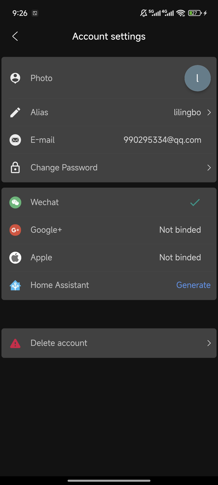
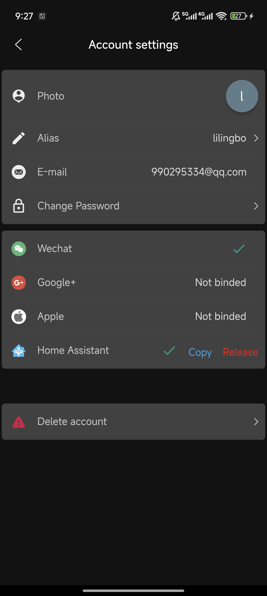

# poer-home-assistant

Home Assistant custom integration for POER devices.

## Important note for upgraders

If, after upgrading, your devices suddenly don't work, please delete them via the UI and re-add them again.  There are a number of new features which require
new metadata to be discovered at the setup phase.  This may not be present on existing devices.
If this doesn't work you can roll back to a previous release via HACS, and please log an issue with the details of your problem.

## Supported devices

This integration supports various models of POER devices, which may also be known as:

- PTC10
- PTC20/26
- PTV30

## Installation

### Requirements

You need to have the POER App configured and working in Home Assistant in order to use this integration.

### Manual installation

Clone this repository into `config/` Home Assistant folder.

### HACS

This integration is now available from within HACS.

Search for "poer" and click install.  You will also get notified of future upgrades.

### API Key

The api key is generated on the app. The app needs to be upgraded to at least version 3.2.26.

Use the following steps to generate:

- Go to the user information page, then find Home Assistant and click the Generate button.

- Click the Copy button to copy it for use.

- If you no longer want to use Home Assistant related functions, please click the Release button.

### Config

After setting up, you can config two parameters Settings -> Integrations -> LEDnetWF -> Config.

- Disconnect delay or timeout: Timeout for bluetooth disconnect (0 for never)

Thanks!